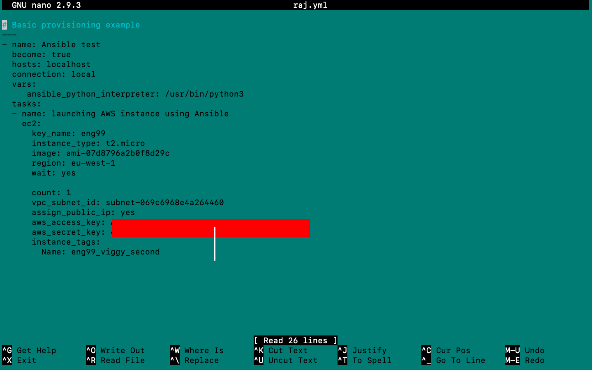
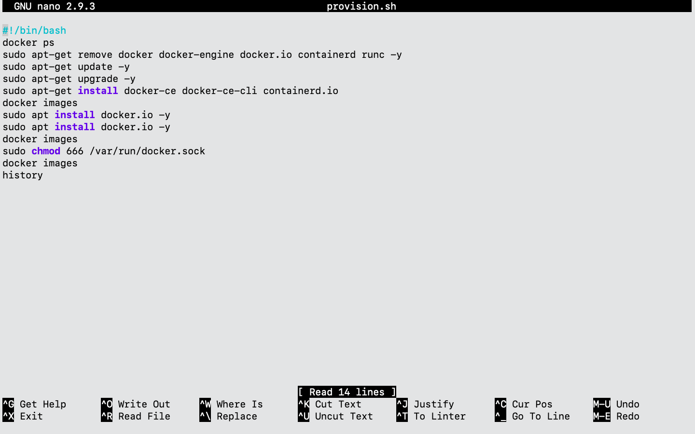

# eng99_week7_day2_nginx-on-aws-docker

## install docker in aws
### Step 1: launch instance
- launch aws instance manually from aws console
### Step 2
- ssh from local host
### Step 3: install docker engine
- Run commands/script on ec2 machine:
    

### step 4: pull and run docker image to create a container:
-       docker run -d -p 80:80 viggy005/my-nginx:v5

## Result:
- the nginx app is globally available
- can be accessed using the ec2 machine public IP

# set-up ansible contoller to launch ec2 insatnce on aws
## requirments
- python --version
    - Python 3.6.9
    - python >= 3.6
- boto3 >= 1.15.0
    - pip install boto3
    - sudo apt install python-pip
    - pip install boto3
    - pip show boto3
    - Version: 1.17.112
- botocore >= 1.18.0
    - sudo apt-get install -y python3-botocore
    - pip show botocore
    - Version: 1.20.112

- pip list boto | grep boto
- pip install --upgrade requests==2.20.1

- ansible-galaxy collection install amazon.aws
## play-book

- command to run play book:
    - sudo ansible-playbook raj.yml --ask-vault-pass

## SSH into ansible provisioned instance:
- sudo update
- sudo upgrade
- copy and run provision script

- chmod provision.sh
- run provision.sh
    - ./provision.sh
- docker login
    - will be promted to enter: docker_hub
        - User Name
        - Password

